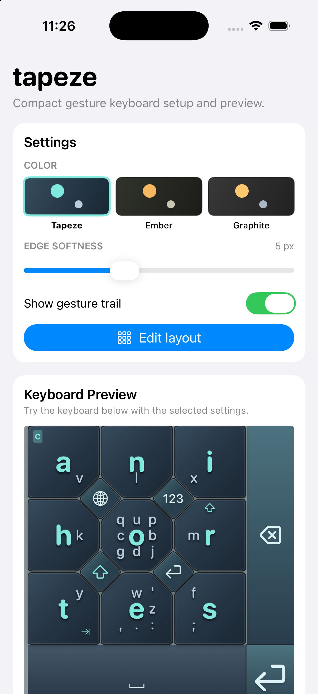
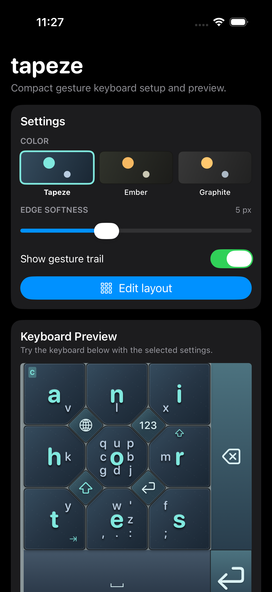

# Tapeze

A compact gesture keyboard for iOS. Nine letter keys, swipe typing, and a layout you can make your own.

<p>
  
  
</p>

Choose a color theme, adjust key edges, show gesture trails, or edit the letter layout in the app.

## Type with gestures

- **Tap** for a key’s center letter; **swipe** toward a surrounding letter to type it.
- **Swipe out and back** for an uppercase swipe letter; **loop** on a key for its uppercase center letter.
- **Long horizontal swipe** across the grid inserts a space; **long vertical swipe** deletes backward. Dedicated space and delete controls work too.
- Use the **123 / abc** control for numbers and symbols, **shift** for capitals, and **return** for a new line.

## Try it

Requires macOS with Xcode 15+ and an iPhone or simulator running iOS 16+.

```bash
git clone https://github.com/gm2211/tapeze.git
cd tapeze
open tapeze.xcodeproj
```

1. Select the **tapeze** scheme and an iPhone simulator, then run with **⌘R**. For a physical iPhone, select your signing team for both targets.
2. In iOS **Settings → General → Keyboard → Keyboards → Add New Keyboard**, select **tapeze**.
3. Open Notes, hold the globe key, and choose **tapeze**. You can also practice in the app’s keyboard preview.

Some system fields require Apple’s keyboard. **Allow Full Access** is optional and enables clipboard access.

For development: [project configuration](project.yml) · [keyboard source](tapezeKeyboard) · [TestFlight release guide](docs/testflight.md). To regenerate the Xcode project with [XcodeGen](https://github.com/yonaskolb/XcodeGen), run `xcodegen generate`.
