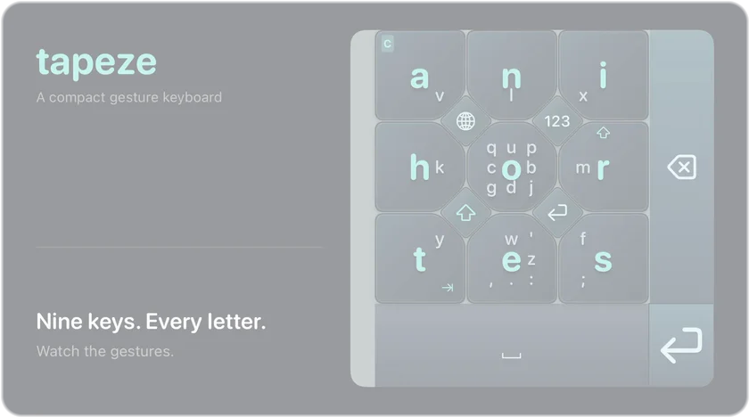

# Tapeze

A compact iOS keyboard. Nine letter keys, swipe typing, customizable layouts and themes.

[](docs/demo/gesture-demo.mp4?raw=true)

[Download MP4](docs/demo/gesture-demo.mp4?raw=true) · [Light screenshot](docs/screenshots/keyboard-settings.png) · [Dark screenshot](docs/screenshots/keyboard-settings-dark.png)

**Tap** a center letter · **Swipe** toward a surrounding letter · **Swipe back or loop** for capitals.

Swipe across the grid horizontally for space, vertically to delete. On-screen controls handle space, delete, shift, numbers, and return.

<details>
<summary><strong>Build and try it</strong> — Xcode 15+, iOS 16+</summary>

```bash
git clone https://github.com/gm2211/tapeze.git
cd tapeze
open Tapeze.xcodeproj
```

1. Run the **tapeze** scheme on an iPhone simulator (**⌘R**). For a physical iPhone, select your signing team for both targets.
2. Add **tapeze** under **Settings → General → Keyboard → Keyboards → Add New Keyboard**.
3. In Notes, hold the globe key and choose **tapeze**, or practice in the app’s preview.

Some system fields require Apple’s keyboard. **Allow Full Access** is optional for clipboard access.

To regenerate the project with [XcodeGen](https://github.com/yonaskolb/XcodeGen), run `xcodegen generate`.

</details>

[Source](tapezeKeyboard) · [Project configuration](project.yml) · [TestFlight guide](docs/testflight.md)
